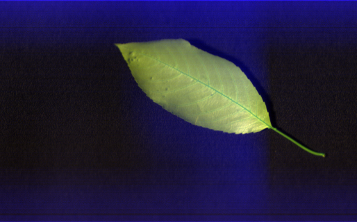
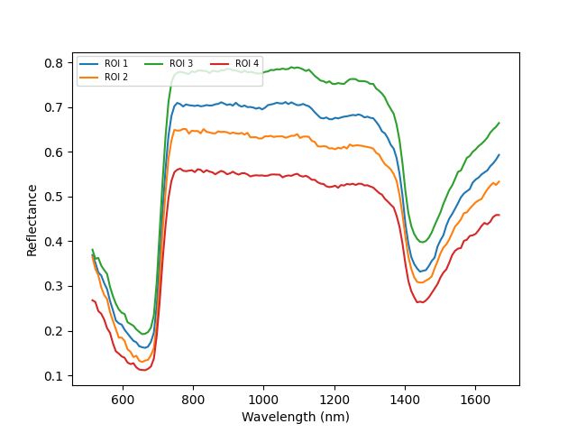
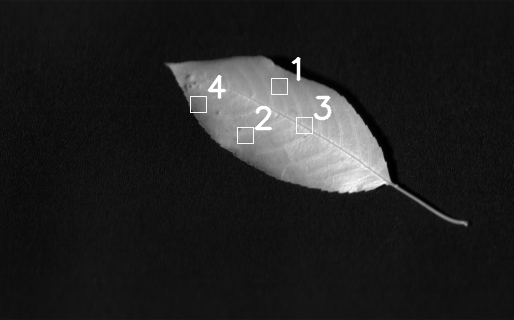

### Needed Libraries
- [spectral]( [conda install -c conda-forge spectral](https://anaconda.org/conda-forge/spectral){:target="_blank"}
- numpy
- matplotlib
- opencv
- pandas
- os


#### Import all the needed libraries
```
from spectral import imshow, view_cube
import spectral.io.envi as envi
import numpy as np
import matplotlib.pyplot as plt
import matplotlib
import cv2
import os
import pandas as pd
```

#### Read the hyperspectral image
The hyperspectral image needs three different images to get a corrected image - *raw data* (raw reflectance values from the camera), *white ref* - which is the reflectance from white calibration surface, and *dark ref* - the refelctance from dark (usually zeros). The white and dark references are used to calibrate and normalise the raw refelctance values using the equation:

$$
    Corrected Image = {{RawReflectance - DarkReflectance} \over {WhiteReflectance - DarkReflectance}}
$$

```
dark_ref = envi.open('path_to_dark_ref.hdr','path_to_dark_ref')
white_ref = envi.open('path_to_white_ref.hdr','path_to_white_ref')
raw_ref = envi.open('path_to_raw.hdr','path_to_raw)
```

#### Load the images

````
bands = data_ref.bands.centers
white_data = np.array(white_ref.load())
dark_data = np.array(dark_ref.load())
raw_data = np.array(data_ref.load())
````

#### Normalised (corrected) image

```
corrected_data = np.divide(
            np.subtract(data_data, dark_data),
            np.subtract(white_data, dark_data))

```

#### View the Image
To view the iimage, we can either select a band or select multiple bands to create a RGB image (select 1 band each from appropriate wavelenth in Red, Green, and Blue spectrum and arrange accordingly). 

The code below visualises RGB image using prebuilt function from spectral library.


```
#Get RGB Image
img = get_rgb(corrected_nparr, bands=None)

#Select single band
#sel = 70
#img = data_ref[:,:,sel]

image = cv2.normalize(img, None, alpha = 0, beta = 255, norm_type = cv2.NORM_MINMAX, dtype = cv2.CV_32F)
image = image.astype(np.uint8)
image = cv2.rotate(image,cv2.ROTATE_90_CLOCKWISE)
cv2.namedWindow("main", cv2.WINDOW_NORMAL)
cv2.imshow('main', image)
cv2.waitKey(0)
cv2.destroyAllWindows()
```


### Important Functions

#### 1. Get Right-click event
```
#the [x, y] for each right-click event will be stored here

right_clicks = list()
#this function will be called whenever the mouse is right-clicked

def mouse_callback(event, x, y, flags, params):
    #right-click event value is 2
    if event == 2:
        global right_clicks
        #store the coordinates of the right-click event
        right_clicks.append([x, y])
```

#### 2. Extract ROI

```

def extract_roi(arr, x, y, w, h, intensity, line):
    roi = arr[y:y+h, x:x+w, :]

    bounding_box = arr
    bounding_box[y-line:y, x-line:x+w+line, :] = intensity # garis atas
    bounding_box[y:y+h, x-line:x, :] = intensity # garis kiri
    bounding_box[y+h:y+h+line, x-line:x+w+line, :] = intensity # garis bawah
    bounding_box[y:y+h, x+w:x+w+line, :] = intensity # garis kanan

    return (roi, bounding_box)
```

#### View the Image to get the ROIs
Right click on the center of the point you want to select

```
cv2.namedWindow("main", cv2.WINDOW_NORMAL)
#set mouse callback function for window
cv2.setMouseCallback('main', mouse_callback) #gives back the right click locations back
image = cv2.rotate(image,cv2.cv2.ROTATE_90_CLOCKWISE)
cv2.imshow('main', image)
cv2.waitKey(0)
cv2.destroyAllWindows()
```

#### Get the ROI

```
coordinates = right_clicks
rois = [] # returned ROIs
length = 20 # width and height
intensity = 2 # bounding box line intensity
line = 25 # bounding box line width
bounding_data = corrected_nparr
```

#### Get the ROI
The ROIs are square boxes of 'length' defined in earlier step

```
for coordinate in coordinates:
    (x, y) = coordinate
    x1 = y
    y1 = image.shape[1]-x
    (roi, bounding_boxed) = extract_roi(
        bounding_boxed, x1, y1, length, length, intensity, line)
    rois.append(roi)
```

#### Reflectance values in the ROI
Get the average refelcetance of all pixels in the ROI. 
```
imshow(bounding_boxed, (100, 100, 100))
int_m = []
for i in range(len(rois)):
    roi = rois[i]
    intensity = []
    for b in range(roi.shape[2]):
        intensity.append(np.mean(roi[:, :, b]))
    int_m.append(intensity)
    int_m_1 = np.array(int_m)
    int_m_1 = np.mean(int_m,axis=0)
    plt.figure(2)
    plt.plot(bands, intensity, label='ROI {}'.format(i+1))
```

#### Plot the average reflectance
```
plt.figure(3)
plt.plot(bands, int_m_1, label='Mean Reflectance')


plt.legend(loc='upper left')
plt.title('Leaf Spectral Footprint\n Mean in ROI Area')
plt.xlabel('Wavelength (nm)')
plt.ylabel('Reflectance')
plt.show()
```


#### Show the final image with ROIs

```
cv2.namedWindow("main", cv2.WINDOW_NORMAL)
image_sel = corrected_nparr[:,:,70]
image_sel = cv2.rotate(image_sel,cv2.cv2.ROTATE_90_CLOCKWISE)
cv2.imshow('main', image_sel)
cv2.waitKey(0)
```
