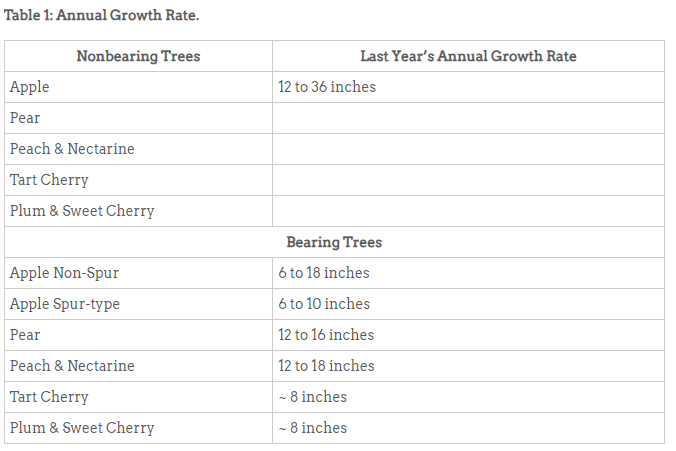

# Fertilising fruit trees

[Fertilizing Fruit Trees - 7.612 - Extension](https://extension.colostate.edu/topic-areas/yard-garden/fertilizing-fruit-trees-7-612/){:target="_blank"}

The maximum rate of nitrogen to apply to pome fruit trees (apples and pears) is 1/10th pound of nitrogen per inch of trunk diameter (measured 1 foot above ground level). Apply this amount if growth the previous year was at the low end of the recommended rate.

Maintain a record on the amount of nitrogen applied each year and the resulting growth. Such records provide a guide for the amount of nitrogen fertilizer to apply to achieve the desired results.

### Applying Nitrogen Based on a Soil Analysis

If a soil analysis has been conducted, the recommendations in Table 2 indicate the amount of nitrogen to apply.

**Calculating the Amount of Fertilizer Applications**

Fertilizer products contain specific quantities of nutrient based on percentage by weight. This is indicated on the product label such as 15-1-1. The first number (15) is the percentage by weight of nitrogen, the second number is the percentage by weight of phosphorus (P2O5) and the third is the percentage by weight of potassium (K2O). For example, ammonium sulfate (21-0-0) contains 21 percent nitrogen while blood meal contains 12 percent to 13 percent nitrogen. The amount of the fertilizer product needed is calculated by dividing the pounds of nutrient needed by the percent of that nutrient in the product.

For example, if you need 1/2 pound of nitrogen for a given area and are using a product with 15 percent Nitrogen, divide .5 (one-half pound) by .15 (the percent of N in the product). This tells you 3.33 pounds of this product are needed to apply 1/2 pound of nitrogen.