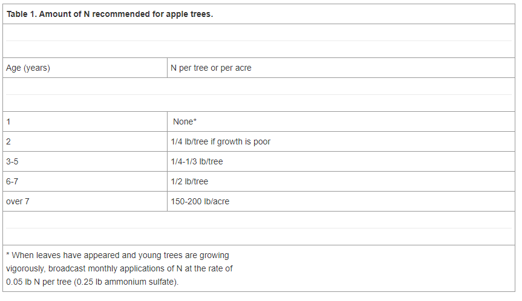

# Fertilization Programs for Apple Orchards, Guide H-319

**Guide H-319**

Esteban A. Herrera, Extension Horticulturist

**College of Agriculture, Consumer and Environmental Sciences New Mexico State University.**

Source: 

[Fertilization Programs for Apple Orchards](https://aces.nmsu.edu/pubs/_h/H319/welcome.html)

Nitrogen rates should be adjusted so young, non-bearing trees grow 24-36 in. per year. The recommended rate is 1/20 lb of pure nitrogen per year of age of tree. To calculate the amount of a given nitrogen fertilizer needed, use the following equation:

1. Age of tree *5 / % of N = lb fertiliser/tree
2.  1/5 lb N (or 1 lb of Ammonium Sulfate) per inch of trunk diameter

Nitrogen fertilization rates for mature, heavy-bearing trees fluctuate from 150 to 200 lb of nitrogen per acre, or 750-1,000 lb of ammonium sulfate per acre. Annual shoot (terminal) growth should be around 6-10 in. per year. If growth patterns are higher or lower, nitrogen rates should be adjusted accordingly. A general recommendation for apple trees is listed in table 1.

Any formulation of nitrogen fertilizer is converted to ammonium, then to nitrate, before it is absorbed by the tree's root system. Nitrates are water soluble and can be easily leached out in irrigation water. Generally, tree utilization of surface broadcast nitrogen fertilizer is low; thus, good fertilization practices are needed to prevent nitrogen losses through leaching. The best way to apply nitrogen and other fertilizers is **through drip irrigation**, where nutrients are carried close to the root system and recommended rates can be evenly distributed throughout the season. Another good way to incorporate nitrogen into the soil is **by injecting liquid fertilizers into the soil**; several applications are needed during the year to take full advantage of this system. Surface broadcast application of nitrogen and other nutrients, with subsequent soil incorporation by discing, will always have some losses, first through volatilization, then through leaching. Splitting fertilization rates throughout the year may prevent most leaching losses, but may not be practical.