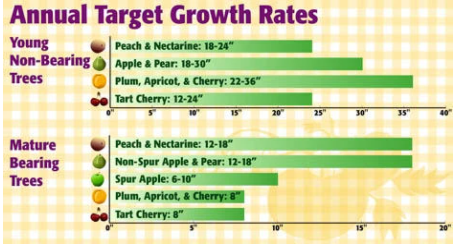

# When & How to Fertilize Your Fruit Trees

[When & How to Fertilizer Your Fruit Trees](https://www.groworganic.com/blogs/articles/when-and-how-to-fertilize-your-fruit-trees)

- **Step 1**
    
    **1. Just before bud break is the perfect time**
    
    **2. Do NOT fertilize in late summer or fall, though, because the new growth put on by the tree can be damaged by frost.**
    
    ### What will happen if the incorrect amount of fertilizer is given?
    
    - **Too much fertilizer** will lead to lots of leaves and shoots, and not a lot of fruit. It could even make your trees weak from too-rapid growth, risking broken branches later in its life.
    - **Too little fertilizer** can cause slow growth and under-performance, so you don’t get as much fruit as you want at harvest time. Not fertilizing fruit trees grown in poor soil can even lead to nutrient deficiencies, poor health, and trees that are less able to fight off diseases and pests.
- **Step 2 Measuring the Previous Year's Growth**
    
    ***Be sure to take your measurements in the winter or early spring while it is dormant, before the tree starts growing again for the new season.***
    
    ### Steps in Measuring the Previous Year's Growth
    
    - First–locate last year’s growth rings. The growth ring is the point on the branch where the tree started growing in the previous season. The newest growth that you will be measuring is often a different color than the rest of the branch.
    - Second–measure from the growth ring all the way out to the end of the branch. Repeat these measurements at several spots around the tree.
    - Third–calculate the average of these measurements. This is the previous season’s “annual growth” of the tree.
    
    Repeat this step for each of your trees. Even if you have several trees of the same variety and age, they may not have grown at the same rate and thus have different fertilizer needs. Note–if you have pruned your tree significantly more than normal, so that you’ve removed over 20% of its canopy within the last year, don’t fertilize until the next year.
    
    Finally, use this chart to evaluate your tree’s annual growth. If the tree’s growth rate is at the low end of, or below, annual target growth, then you should fertilize the tree this year. If your tree’s growth rate is at the high end of, or above, the annual target growth rate, you do not need to fertilize this year (but measure again next year in case that changes!).
    
    
    
    - Peaches and nectarines–non-bearing young trees should grow 18"-24", mature bearing trees should grow 12"-18".
    - Apples and pears–non-bearing young trees should grow 18"-30", mature bearing pears and non-spur type apples should grow 12"-18".
    - Bearing spur apples should grow 6"-10".
    - Plums and sweet cherries–non-bearing young trees should grow 22"-36", mature bearing trees should grow 8".
    - Tart cherries–non-bearing young trees should grow 12"-24", bearing mature trees should grow 8".
- **Step 3: Choose the Right Fertilizer**
    
    
- **Step 4: Calculate how Much Fertilizer to Use**
    
    More is not always better when it comes to fertilizing your fruit trees.
    
    The amount of fertilizer you will use is calculated based on the age or size of the tree, and the nitrogen-value on the package.
    
    ### Determining How Much Fertilizer to Use
    
    - Trees need 0.10 pounds of “actual nitrogen” per year of age, or per inch of trunk diameter (measured 1 foot above the ground). The maximum you should give a fruit tree in a year is 1 pound of actual nitrogen.
    - For example, if your tree has a diameter of 5 inches (or, if your tree is 5 years old), multiply 5 by 0.10 pounds of nitrogen, equals 0.5 lb. This means that the tree will need 0.5 lb of actual nitrogen.
    - But wait, you’re not done yet! “Actual nitrogen” pounds is not the as simple as just weighing out that amount of fertilizer, because there is more in a fertilizer than just nitrogen.
    - The NPK numbers on fertilizer show the percentage of nutrients per pound of fertilizer, not the actual amount. N, P and K refer to nitrogen, phosphorus, and potassium.
    - For example, if the N listed on the fertilizer package is 7 (meaning 7% nitrogen), such as with E.B. Stone’s Fruit Tree fertilizer, then there is 0.07 pounds of actual nitrogen for every pound of fertilizer.
    - To calculate how much fertilizer to apply, divide the amount of actual nitrogen the tree needs by the amount of actual nitrogen per pound in the fertilizer.
    - So, using the previous examples, a five-year-old apple tree needs 0.5 lb of nitrogen. The E.B. Stone Fruit Tree Fertilizer has an N-value of 7 on the package, meaning it has 0.07 lb nitrogen per pound of fertilizer. Half a pound, or 0.5 lb, divided by 0.07 lb equals 7 lbs. The answer–7 pounds–is the amount of this fertilizer to apply to the tree.
- **Step 5: Applying the Fertilizer**
    
    To help the tree “eat” the fertilizer most efficiently, apply the fertilizer evenly starting a foot away from the trunk and continue all the way to the “drip line.” The drip line is the perimeter of the tree’s furthest reaching branches.
    
    - The easiest way to do this is simply by spreading the fertilizer on the ground and raking it in.
    - Digging a series of small holes is another method of applying fertilizer. It is a bit more work, but it best ensures the fertilizer is getting to the tree roots, especially when using a fertilizer containing less-soluble nutrients like phosphorus and mycorrhizae.
    - Dig the holes six inches down and 12” to 18” apart, throughout the same area as you would have spread the fertilizer. To make the digging job easy you can use an [auger attachment](http://www.groworganic.com/bulb-auger.html) with a cordless drill. Sprinkle a little bit of fertilizer in each hole until it is used up.
    - Once you have finished fertilizing, spread an inch-deep layer of [compost](http://www.groworganic.com/peaceful-valley-compost-1-cubic-ft.html) around the tree and water well.